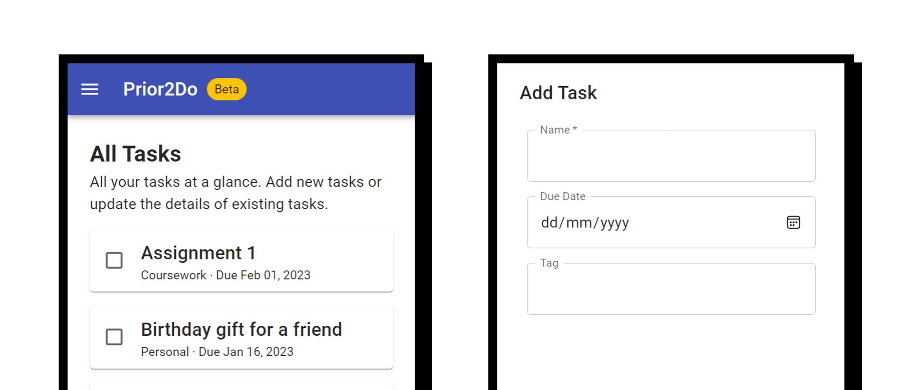
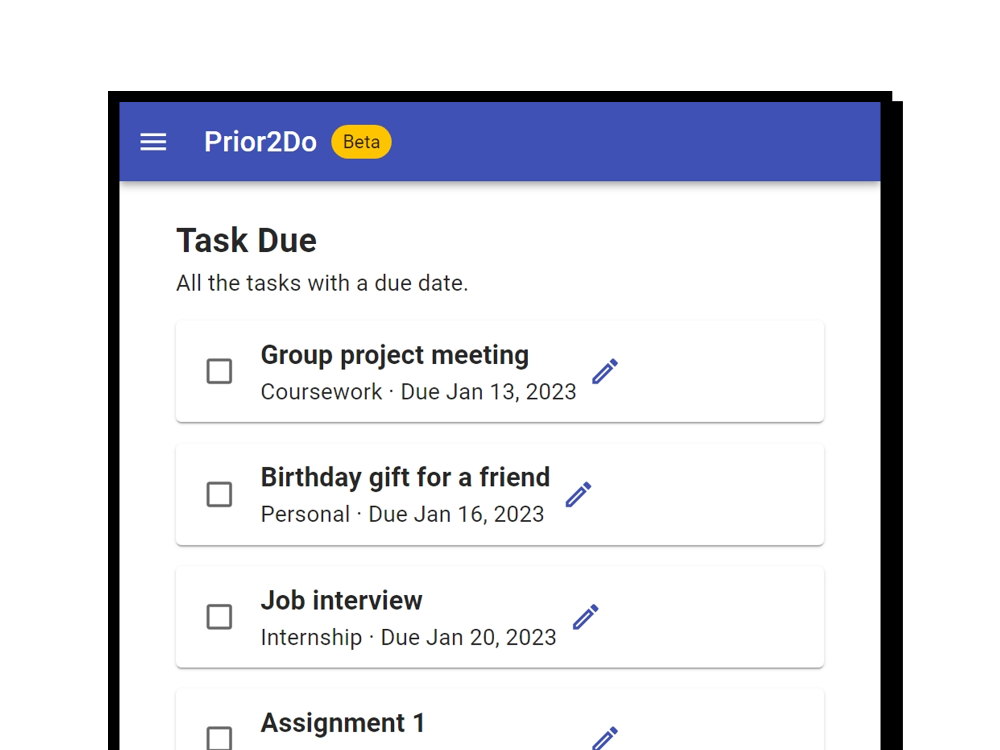
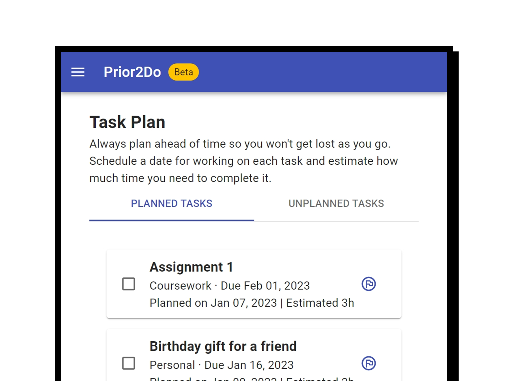
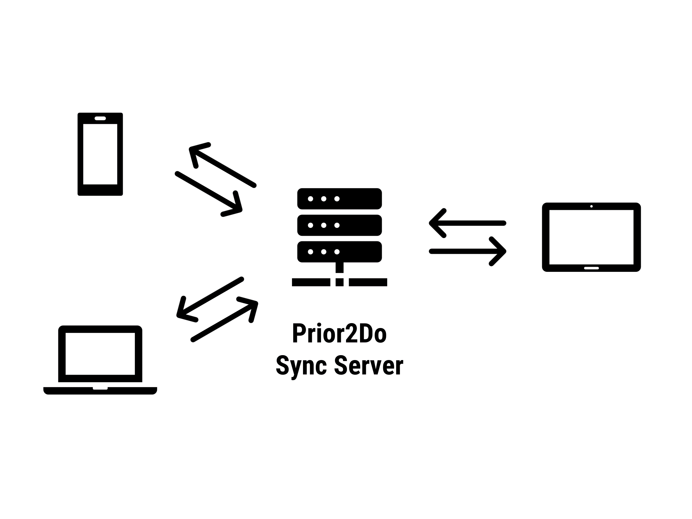
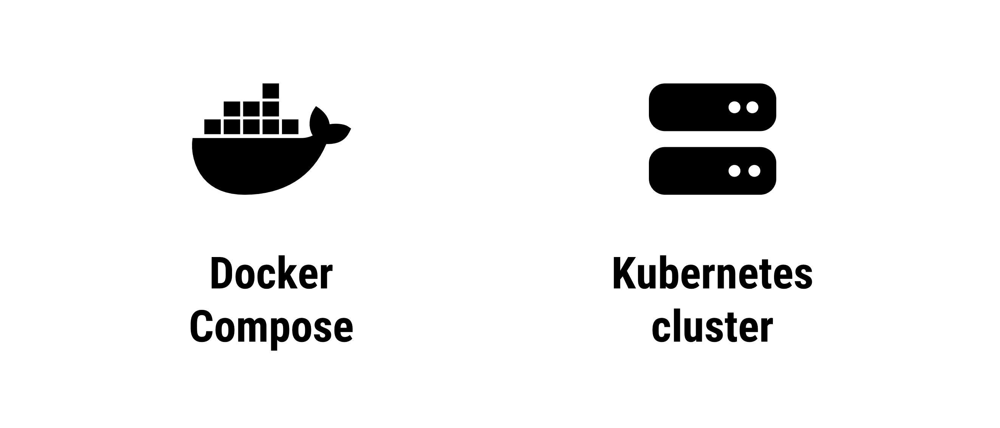
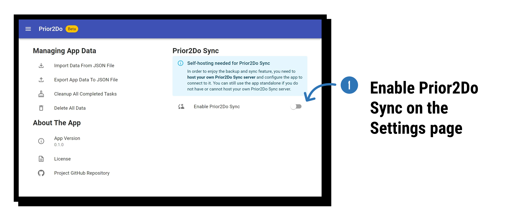
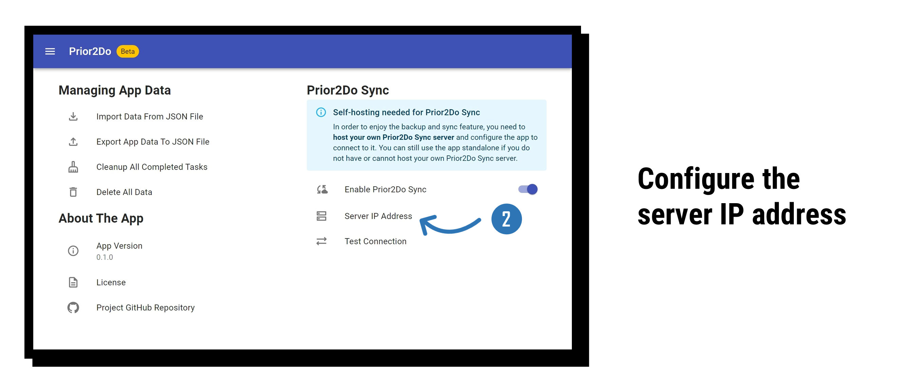
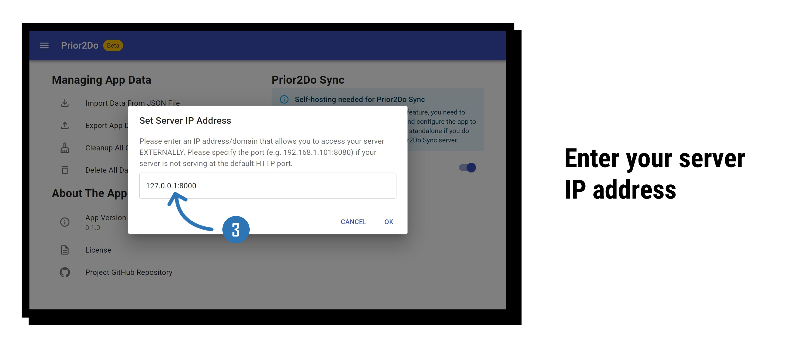
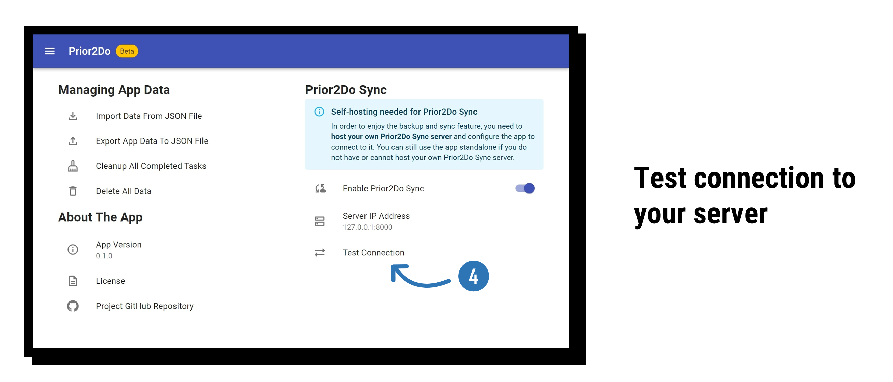
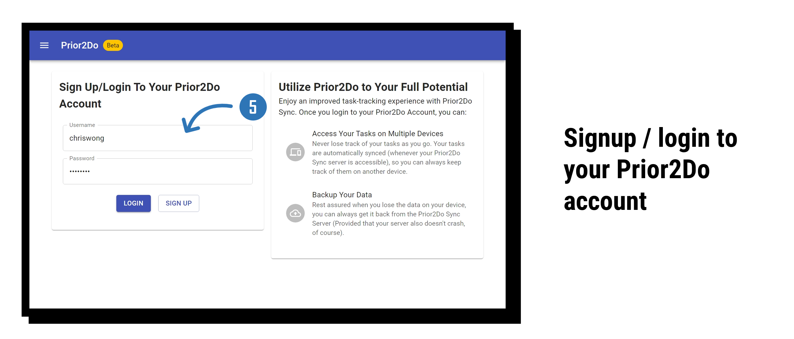

# Prior2Do


**_Prior2Do_** is a to-do app that goes one step further to accelerate your productivity. It works just like other to-do apps - you can keep track of all the tasks you have to complete. But with the additional **Task Plan** feature, you can schedule dates to complete your tasks, estimate how much time you need to spend on each task so you can better manage your time, and complete your tasks based on your plan so you won't lose track as you go.

[Try the web app now!](http://bench352.github.io/prior2do)

## Features

The app is still in development, and more features will be added in future releases. Here is what the app can (currently) do:

### Track Your Tasks



Just like any to-do app, you can keep track of all the tasks you have to do. On the _All Tasks_ page of the app, you can

- **Add new tasks** to the app
- Assign a **due date** for a task
- Assign a **tag** to a task to categorize it

### Task Due



All the tasks with an assigned due date can be viewed on the _Task Due_ page, which sorts the tasks by ascending due dates.

### Task Plan



What makes Prior2Do different from other to-do apps is the included _Task Plan_ feature, which lets you plan your tasks ahead of time. On the _Task Plan_ page:

- Every task you added to the app would go to the **Unplanned Tasks** session.
- To **plan a task**, you can **assign a date** for working on the task. It is _different from_ the due date, representing the date you are tackling the task.
- You can **estimate how much time (in hours)** you need to tackle the task on that day. Using this feature in conjunction with the [timeboxing technique](https://en.wikipedia.org/wiki/Timeboxing) can help boost your productivity and improve your time management.
- On the date you set a plan for specific tasks, those tasks will show up on the _Home Page_ too.

### Prior2Do Sync



Prior2Do Sync is a server that provides a **backup and sync** service for your Prior2Do app. Once your app is connected to the Prior2Do Sync server, you can log in to your Prior2Do account and have your tasks **automatically backed up** and **synced across multiple devices**. A Prior2Do Sync server can be shared by multiple users.

No managed Prior2Do Sync server instance is available for public use, so you will need to host your own Prior2Do Sync Server with one of the available deployment options (see next session) and configure your app to connect to it. The app would still work standalone, and **you can still back up and restore your task data with JSON files** within the _Settings_ page.

## Deployment

If you have your own server or Kubernetes cluster, you can spin up your own Prior2Do Sync server with the following **deployment options**:



Both deployment options would spin up a Prior2Do web app, a Prior2Do Sync server, and a [Neo4j Graph Database](https://neo4j.com/product/neo4j-graph-database/) for the Sync server to store user data.

### Before You Start

The server uses the HS256 algorithm to sign the JWT tokens generated by the server. A key (i.e. a piece of string) can be provided to the Prior2Do Sync server as a Secret Key for signing and validating the JWT tokens. The server has a default one (which is not secure), and it is recommended to set your Secret Key so only JWT tokens generated by your own server can be authenticated.

You can set whatever key you want for the Secret Key, and one way to get a randomly generated secure key is with the OpenSSL utility. Open your Bash Shell (on Linux/macOS) or use Git Bash (available when you install [Git](https://git-scm.com/downloads) on Windows) and run the following command to generate a secret key:

```bash
openssl rand -hex 32
```

To set the Secret Key for the Prior2Do server, set the `SECRET_KEY` environment variable to your preferred Secret Key. Instructions will be provided for ways to set the Secret Key with the deployment options below.

### Docker Compose

Using [Docker](https://www.docker.com/), you can spin up your Prior2Do Sync server with **Docker Compose**. A `docker-compose.yml` file is available for conveniently getting your server up and running.

To run your server immediately, download the [docker-compose.yml]() file on your computer. Open the terminal and `cd` (change directory) to where the `docker-compose.yml` file locates, then run the following command:

```bash
docker-compose up -d
```

You may want to spend some time **configuring your secret key** as well as **changing the password for the Neo4j Graph Database**. In the `docker-compose.yml` file, you can see the environment variables for the Prior2Do Sync server as below:

```yaml

---
api-server:
  image: bench352/prior2do-syncserver
  ports:
    - 8000:8000
  environment:
    NEO4J_HOST: database
    NEO4J_PORT: 7687
    NEO4J_USERNAME: neo4j
    NEO4J_PASSWORD: <password>
    SECRET_KEY: <YOUR_SECRET_KEY_HERE>
```

replace `<YOUR_SECRET_KEY_HERE>` with your own Secret Key for generating the JWT tokens. If you wish to change the password for the database, replace `<password>` next to `NEO4J_PASSWORD` with your desired password. Don't forget to update the environment variable for the Neo4j Graph Database too:

```yaml

---
database:
  image: neo4j
  volumes:
    - neo4j-data:/data
  environment:
    NEO4J_AUTH: neo4j/<password>
```

Again, replace `<password>` with your desired database password. Make sure it matches the one you set for the Prior2Do Sync server so the server can connect to the database successfully.

### Kubernetes cluster

If you have a Kubernetes cluster, you can deploy the Prior2Do Sync server with the provided **Helm Chart**.

Here are the parameters you can set to customize your deployment. Alternatively, you can provide a custom `values.yaml` that contains the modified value for the parameters.

#### Prior2Do Web App Parameters

| Name                      | Description                                                                 | Default value              |
| ------------------------- | --------------------------------------------------------------------------- | -------------------------- |
| `webapp.image.repository` | Docker image for the Prior2Do web app                                       | `bench352/prior2do-webapp` |
| `webapp.image.pullPolicy` | Image pull policy for the Prior2Do web app                                  | `IfNotPresent`             |
| `webapp.image.latest`     | Docker image version                                                        | `latest`                   |
| `webapp.service.type`     | Kubernetes service type for the Prior2Do web app                            | `NodePort`                 |
| `webapp.service.port`     | Service port for inter-cluster connections                                  | `80`                       |
| `webapp.service.nodePort` | Node port for exposing the web app if the service type is set to `NodePort` | `30030`                    |

#### Prior2Do Sync Server Parameters

| Name                         | Description                                                                | Default value                  |
| ---------------------------- | -------------------------------------------------------------------------- | ------------------------------ |
| `apiserver.image.repository` | Docker image for the Prior2Do Sync server                                  | `bench352/prior2do-syncserver` |
| `apiserver.image.pullPolicy` | Image pull policy for the Prior2Do Sync server                             | `IfNotPresent`                 |
| `apiserver.image.tag`        | Docker image version                                                       | `latest`                       |
| `apiserver.service.type`     | Kubernetes service type for the Prior2Do Sync server                       | `NodePort`                     |
| `apiserver.service.port`     | Service port for inter-cluster connections                                 | `80`                           |
| `apiserver.service.nodePort` | Node port for exposing the server if the service type is set to `NodePort` | `30080`                        |
| `apiserver.secretKey`        | Secret Key for signing JWT tokens                                          | `SECRET_KEY`                   |

#### Neo4j Graph Database Parameters

| Name                   | Description                           | Default value |
| ---------------------- | ------------------------------------- | ------------- |
| `neo4j.neo4j.password` | Password for the Neo4j Graph Database | `<password>`  |

### Configure Your Prior2Do App

Once you have your Prior2Do Sync server ready, you can configure your Prior2Do app to connect to it. Here are the steps to set it up:



In the **Settings** page, toggle the switch next to the "Enable Prior2Do Sync" option to enable the Prior2Do Sync function in your app.



More options will be shown under the "Enable Prior2Do Sync" option, and you will also see a new "User" option that leads to the User page showing up on the side navigation menu. However, you will still have to configure the server IP address to make the Prior2Do Sync feature work. Click on "Server IP Address" to configure the IP address of your Prior2Do Sync server.



You will see a dialog for entering your server IP address. Enter an IP address that allows you to access the server, and don't forget to include the port if your server is not hosted on the default HTTP port. Press "OK" to confirm your input.



You can now click the "Test Connection" option to check if your Prior2Do app can successfully communicate with your Prior2Do Sync server.



You can now log in or signup for your Prior2Do Account on the User page and enjoy the backup and sync feature.
