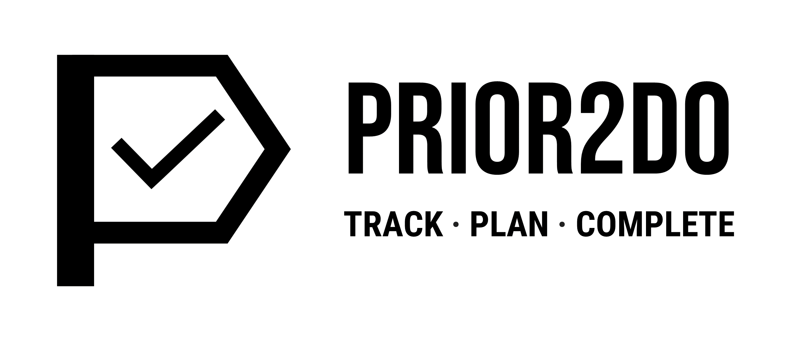

# Prior2Do (Discontinued)

**_Prior2Do_** is a proof-of-concept to-do app. It works just like other to-do apps - you can keep track of all the tasks you have to complete. But with the additional **Task Plan** feature, you can schedule dates to complete your tasks, estimate how much time you need to spend on each task to manage your time better and complete your tasks based on your plan so you won't lose track as you go.

> The development of the Prior2Do app **has been discontinued** and will not be maintained for the foreseeable future. The app has not been thoroughly tested, and some features are unavailable in this release due to limited development time. The app is not expected to be used on a daily basis.

[See the web app in action](http://bench352.github.io/prior2do)

## Features

### Track Your Tasks

Just like any to-do app, you can keep track of all the tasks you have to do. The **Tasks page** allows you to create and manage tasks, including the ability to **sort task by title/due date/estimated time**. The **Quick Add Task** feature also allows you to quickly create a new task by simply entering the task's name.

You can include a Task Description (with Markdown support), due date, estimated time, a tag, and a list of subtasks for any task.

### Organise Tasks with Tags

You can create **Tags** to organise your task. You can also click on a tag on the sidebar to **filter tasks by tag**.

### Due Calendar

The due date of all your tasks can be viewed easily on the **Calendar page**. You can also **filter the tasks on the calendar by tag**. You can also **create a new task with the corresponding due date** by clicking the day on the calendar.

### Plan Your Task

What makes Prior2Do different from other to-do apps is the included **Task Plan** feature, which lets you plan your tasks ahead. You can create multiple **Work Sessions** for a single task, each with its own planned date and estimated time.

You can also view all the planned work sessions at once with the **View Plans** section and **Calendar View** on the Task Plan Page.

### Dashboard

The **Dashboard** is the app's home screen that lets you view essential information at a glance. You can see your **Today's Plan** (plan for the day), the **upcoming due date** for your tasks, the **planned work hours** (the sum of the estimated time for work sessions for each day), and a customisable quote to be displayed.

### Prior2Do Sync

> This functionality is only available on **versions 0.1.0 and 0.1.1** only. Deployment methods will be included in the the source code of previous releases. See [the Releases section](https://github.com/bench352/prior2do/releases).

Prior2Do Sync is a server that provides a **backup and sync** service for your Prior2Do app. Once your app is connected to the Prior2Do Sync server, you can log in to your Prior2Do account and have your tasks **automatically backed up** and **synced across multiple devices**. A Prior2Do Sync server can be shared by multiple users.

